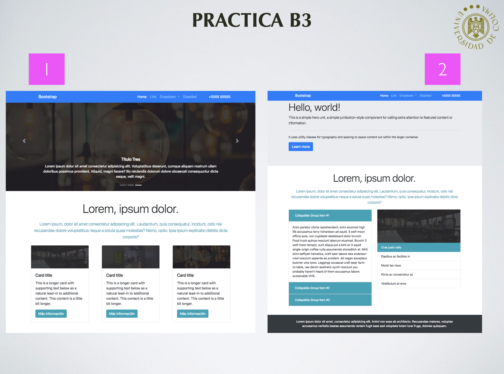

# Practica-B3-PrograMovil
Practica B3 de Programación Móvil

## Objetivos 🥅

Al finalizar esta practica: 
- Habras copiado el diseño de una paguina mostrada en la imagen, utilizando boostrap.

## Paguina a duplicar el diseño

